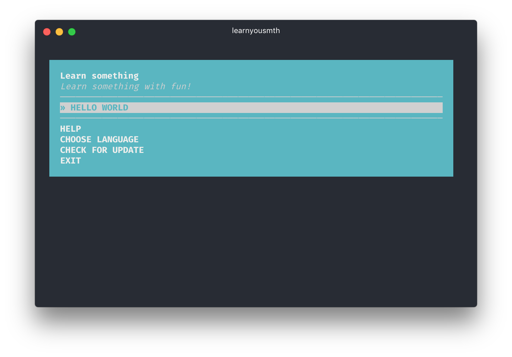

# workshopper-boilerplate

> Simple boilerplate for NodeSchool workshopper

I've built three workshoppers for NodeSchool:

* [**learnyoubash**](https://github.com/denysdovhan/learnyoubash)
* [**learnyouhtml**](https://github.com/denysdovhan/learnyouhtml)
* [**how-to-markdown**](https://github.com/workshopper/how-to-markdown)

Unfortunately, there's no documentation for [workshopper-adventure](https://github.com/workshopper/workshopper-adventure) framework. [Martin Heidegger](https://github.com/martinheidegger) gladly [helped me to build a good scaffolds](https://github.com/denysdovhan/learnyoubash/pull/1) for **learnyoubash** workshopper and I use the same structure for each of my workshoppers.

This boilerplate has few advantages:

* Simple and unified structure
* Ready for localization
* Easy to create custom footer
* Easy to create custom messages for solutions
* Tests for exercises
* Linting of workshopper sources
* README with nice badges

## How to setup

It's easy to setup your workshopper. Just go through these simple steps:

1. Clone the boilerplate:
  ```
  git clone git@github.com:denysdovhan/workshopper-boilerplate.git
  ```
1. Remove `.git` folder:
  ```
  rm -rf .git
  ```
1. Find and replace all occurrences of `learnyousmth` by your workshopper's name
1. Find and replace all occurrences  of `yourname` by your GitHub username
1. Initialize new repository:
  ```
  git init
  ```
1. Commit the scaffolded boilerplate:
  ```
  git add . && git commit -m "Initial commit"
  ```
1. Enable [Travis CI](travis-ci.org) for this
1. Develop your own wokrshopper. See comments in source files for better understanding
1. Clean-up `README.md`
1. Profit!

Take a look at my other workshoppers, if you need more examples.

## Workshopper structure

```
.
├── bin
│   └── learnyousmth              Executable file, `bin` in package.json
├── exercises
│   └── hello_world               Exercise folder
│       ├── en.md                   Exercise description
│       ├── exercise.js             Entry point of exercise
│       └── solution                Solution folder
│           ├── en.md               Solution description
│           └── solution.js         Official solution
├── i18n
│   ├── en.json                   Localization file
│   ├── footer                    Localization for footer
│   │   └── en.md                   Add a file for your language
│   └── troubleshooting           Localization for troubleshooting
│       └── en.md                   Add a file for your language
├── test
│   └── hello_world               Test cases for exercise
│       ├── invalid.js              Invalid solution (should fail)
│       └── valid.js                Valid solution (should pass)
├── utils                         Utils for workshopper
│   ├── diff.js                   Colorful diffs between attempt and solution
│   ├── problem.js                Export function for creating an exercise
│   └── troubleshooting.js        Utility for formatin troubleshooting message
├── .editorconfig                 See: http://editorconfig.org/
├── .eslintrc.json                ESLint configuration (by AirBnB)
├── .gitignore
├── .npmignore
├── .travis.yml                   Configuration for Travis
├── index.js                      Creates an instance of workshopper, adds exercises
├── package.json
├── preview.png                   Preview image of workshopper for README.md
└── README.md                     This file
```

## License

MIT © [Denys Dovhan](http://denysdovhan.com)

---

---

---



# learnyousmth

[![NPM version][npm-image]][npm-url]
[![node][node-image]][node-url]
[![Build Status][buildstat-image]][buildstat-url]
[![Dependency Status][depstat-image]][depstat-url]

> Learn something with fun!

Here is a simple boilerplate.

## Exercises

This workshopper has X exercises that cover the most important aspects of something.

* **HELLO WORLD** — introduction to something.

## Requirements

If you are on Windows, make sure you are using at least version 5.1.0 of Node.js, which provides a fix for a bug in Windows where you can't choose items in the menu.

* [**Node.js**](node-url) >=4.0.0 (>=5.1.0 for Windows)

## Installation

Open your terminal and run this command:

    npm install -g learnyousmth

Use `sudo` if you get an `EACCESS` error.

## Usage

Open your terminal and run the following command:

    learnyousmth

## License

MIT © [Your Name](http://yourname.com)

<!-- References -->

<!-- Your references for links go here -->

<!-- Badges -->

[npm-url]: https://npmjs.org/package/learnyousmth
[npm-image]: https://img.shields.io/npm/v/learnyousmth.svg?style=flat-square

[node-url]: https://nodejs.org/en/download/
[node-image]: https://img.shields.io/node/v/learnyousmth.svg?style=flat-square

[depstat-url]: https://david-dm.org/yourname/learnyousmth
[depstat-image]: https://david-dm.org/yourname/learnyousmth.svg?style=flat-square

[buildstat-url]: https://travis-ci.org/yourname/learnyousmth
[buildstat-image]: https://img.shields.io/travis/yourname/learnyousmth.svg?style=flat-square
